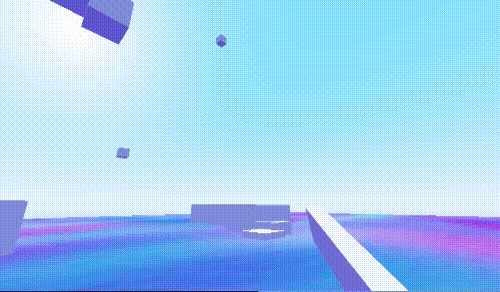

# Reinstancing World Scenes and Physics Masks Demo

### Overview

Adapted from the [`3D Movement Demo`](https://github.com/Yuminous/Godot-Shorts/tree/main/3.3%20%E2%86%92%20Rudimentary%203D%20Movement%20incl.%20Flight), this is a basic demonstration of level or world switching [`without changing`](https://godotengine.org/qa/109821/4d-world-world-with-different-dimensions) the main scene, through the deletion and re-instancing of scenes. It also provides a small example of how physics layers can change how the player interacts with the environment.

### Download
[`   Downgit   `](https://downgit.github.io/#/home?url=https://github.com/Yuminous/Godot-Shorts/tree/main/3.3%20%E2%86%92%20Reinstancing%20Levels%20and%20Physics%20Masks) [`  Download-Directory  `](https://download-directory.github.io/?url=https://github.com/Yuminous/Godot-Shorts/tree/main/3.3%20%E2%86%92%20Reinstancing%20Levels%20and%20Physics%20Masks) [`  ZIP Download  `](https://github.com/Yuminous/Godot-Shorts/raw/main/ZIP/3.3-ReinstancingLevelScenes-PhysicsMasks.zip)
## Screenshots

