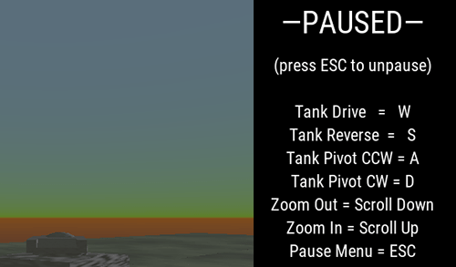

# 3D Rigid Body Tank Movement

### Overview

A demonstration of [`tank-like movement`](https://godotengine.org/qa/110889/cannot-get-tank-control-system-to-work) where the vehicle will accelerate in the direction it's facing, rather than where the player points.

### Download
[`   Downgit   `](https://downgit.github.io/#/home?url=https://github.com/Yuminous/Godot-Shorts/tree/main/3.3%20%E2%86%92%20Rigid%20Tank%20Movement) [`  Download-Directory  `](https://download-directory.github.io/?url=https%3A%2F%2Fgithub.com%2FYuminous%2FGodot-Shorts%2Ftree%2Fmain%2F3.3%2520%25E2%2586%2592%2520Rigid%2520Tank%2520Movement) [`  ZIP Download  `](https://github.com/Yuminous/Godot-Shorts/raw/main/ZIP/3.3-RigidTankMovement.zip)
## Screenshots

