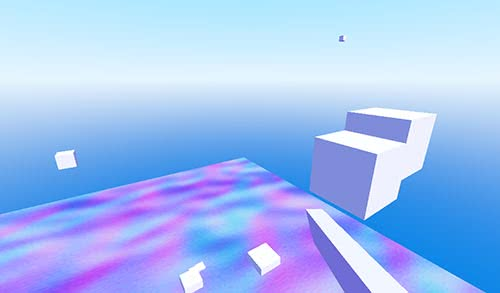
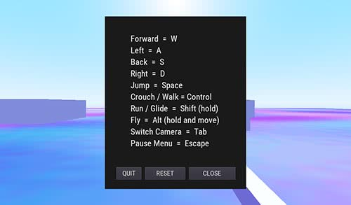

# Basic 3D Movement including Flight

### Overview

A demo built to answer a forum question, showcasing basic movement, gravity, jump and including a flight ability based on the camera viewpoint.
`move_and_slide` is used extensively in this demo for all movement aspects and thus collision detection is somewhat unreliable.

There is much room for improvement to be gained by extending the code.

### Download
[`   Downgit   `](https://downgit.github.io/#/home?url=https:%2F%2Fgithub.com%2FYuminous%2FGodot-Shorts%2Ftree%2Fmain%2F3.3%20%E2%86%92%20Rudimentary%203D%20Movement%20incl.%20Flight) [`  Download-Directory  `](https://download-directory.github.io/?url=https%3A%2F%2Fgithub.com%2FYuminous%2FGodot-Shorts%2Ftree%2Fmain%2F3.3%2520%25E2%2586%2592%2520Rudimentary%25203D%2520Movement%2520incl.%2520Flight)
## Screenshots

