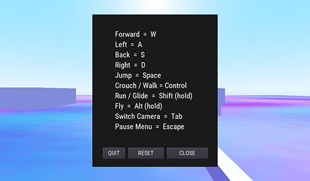

# Basic 3D Movement including Flight

### Overview

A demo built to answer a forum question, showcasing basic movement, gravity, jump and including a flight ability based on the camera viewpoint.
`move_and_slide` is used extensively in this demo for all movement aspects and thus collision detection is somewhat unreliable.

There is much room for improvement to be gained by extending the code.

## Screenshots

